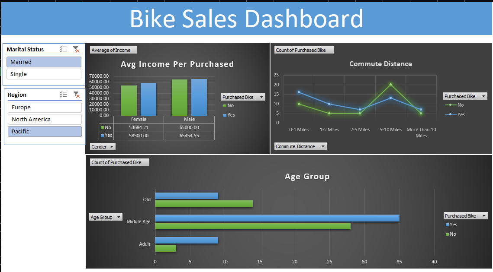

> Bike Sales Dashboard

This project is an interactive Excel dashboard that explores how demographics and commute habits influence bike purchases. It's designed to deliver clear insights for business teams looking to understand "who their customers really are".

> Project Summary

- Tool Used: Microsoft Excel
- File: [`practiceExcel.xlsx`](./practiceExcel.xlsx)
- Dashboard Screenshot: [`bike_sales_dashboard.png`](./bike_sales_dashboard.png)

The goal was to use basic Excel features (like PivotTables, charts, and slicers) to turn raw data into a dashboard that supports business decision-making.

> What the Dashboard Shows
> Key Visuals

- Average Income by Gender vs. Purchase Behavior
- Commute Distance vs. Likelihood of Buying a Bike
- Age Group Breakdown of Purchasers

> Slicers Used
- Region
- Marital Status

> Insights
- Middle-aged users buy bikes the most.
- People commuting 5–10 miles are more likely to purchase.
- Bike buyers generally have slightly higher income, but income alone isn't the only factor.
- Gender doesn’t show extreme bias—both males and females are represented evenly.

> What I Practiced

- PivotTables & PivotCharts in Excel
- Designing dashboards for non-technical users
- Using slicers for interactivity
- Drawing data insights from raw transactional data
- Clean, minimal layout for easy business use

> Dashboard Preview

